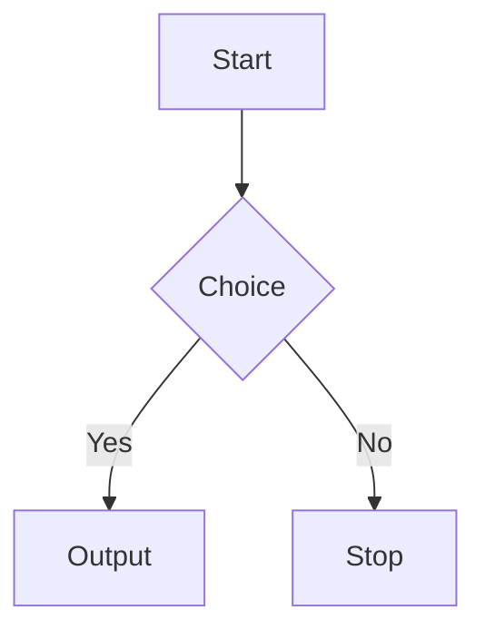
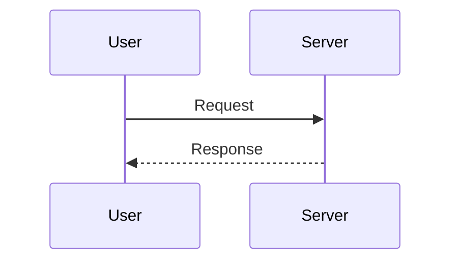

Progress: <br />
Javascript (working on it)<br />
DSA<br />

Markdown guide:

---

# 📌 1. HEADINGS
# Heading 1
## Heading 2
### Heading 3
#### Heading 4
##### Heading 5
###### Heading 6

Underline style:
Heading 1
=========
Heading 2
---------

---

# 📌 2. BASIC TEXT FORMATTING
**Bold**  
*Italic*  
***Bold + Italic***  
~~Strikethrough~~  
<u>Underline</u>  
<mark>Highlight</mark>  

Superscript / Subscript:  
X<sup>2</sup>  
H<sub>2</sub>O  

---

# 📌 3. PARAGRAPHS & LINE BREAKS
Line 1  
Line 2  

---

# 📌 4. LISTS

Unordered:
- Item  
- Item  
  - Sub Item  

Ordered:
1. First  
2. Second  
   1. Sub  

Mixed:
- Item  
  1. Number inside  

---

# 📌 5. CHECKLISTS
- [x] Completed  
- [ ] Not completed  

---

# 📌 6. LINKS
[Google](https://google.com)  
<https://google.com>  

Anchor:
[Go to Headings](#1-headings)

---

# 📌 7. IMAGES


Clickable:
[](link)

Resize:


---

# 📌 8. BLOCKQUOTES
> Quote  
>> Nested  

---

# 📌 9. INLINE CODE
`inline code`

---

# 📌 10. CODE BLOCKS
```cpp
#include <iostream>
int main() {}
```

---

# 📌 11. TABLES
| Name | Age |
|------|-----|
| Melvin | 20 |

Aligned:
| Left | Center | Right |
|:-----|:------:|------:|
| a    |   b    |     c |

---

# 📌 12. HORIZONTAL RULES
---
***
___

---

# 📌 13. EMOJIS
:fire: :star: :zap: :rocket: :smile:

---

# 📌 14. COLLAPSIBLE SECTIONS
<details>
<summary>Click to expand</summary>

Hidden content.

</details>

---

# 📌 15. TABLE OF CONTENTS
- [Headings](#1-headings)
- [Lists](#4-lists)
- [Tables](#11-tables)

---

# 📌 16. BADGES
  
  
  

---

# 📌 17. HTML IN MARKDOWN

Center:
<p align="center">Centered text</p>

Color:
<span style="color:red">Red text</span>

---

# 📌 18. CALLOUT BOXES
> ⚠️ **Warning:** Important!  
> ℹ️ **Note:** Info  
> ✅ **Success:** Completed  

---

# 📌 19. FOOTNOTES
Footnote example.[^1]  
[^1]: This is the footnote.

---

# 📌 20. MERMAID DIAGRAMS

Flowchart:


Sequence:


---

# 📌 21. MATH (LaTeX)
Inline:  
$E = mc^2$

Block:
$$
a^2 + b^2 = c^2
$$

---

# 📌 22. COMMENTS
<!-- Invisible comment -->

---

# 📌 23. ESCAPING CHARACTERS
\*not italic\*  
\# not heading  

---

# 📌 24. FOLDABLE CODE BLOCK
<details>
<summary>Show code</summary>

```js
console.log("Hello");
```

</details>

---

# 📌 25. YAML FRONTMATTER
---
title: My Page  
author: Melvin  
---

---

# 📌 26. HTML BOXES
<div style="border:1px solid #ccc;padding:10px;border-radius:8px;">
<b>Task:</b> Build API<br>
<b>Status:</b> Pending
</div>

---

# 📌 27. DIFF BLOCKS
```diff
+ Added line
- Removed line
! Modified
```

---

# 📌 28. MULTI-COLUMNS
<div style="display:flex; gap:10px;">
  <div style="flex:1;">Left</div>
  <div style="flex:1;">Right</div>
</div>

---

# 📌 29. SPACING TRICKS
&nbsp;  
<br><br>

---

# 📌 30. SPECIAL SYMBOLS
© ® ™  
← ↑ → ↓ ⇨ ⇦  

---

# 📌 31. GITHUB-SPECIFIC STUFF
@mention  
#123 (issue link)  
Fixes #10 (auto close)  

---

# 🎉 END — COMPLETE MARKDOWN MEGASHEET  
This single block contains every Markdown feature you'll ever need.
